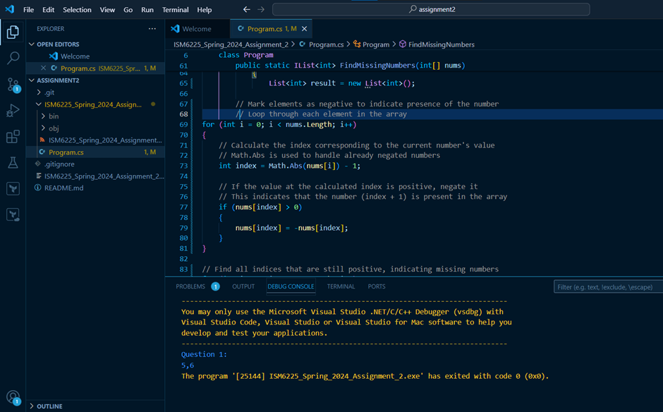
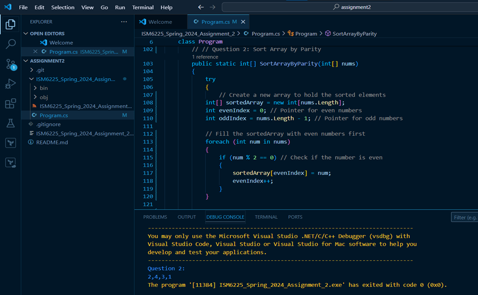
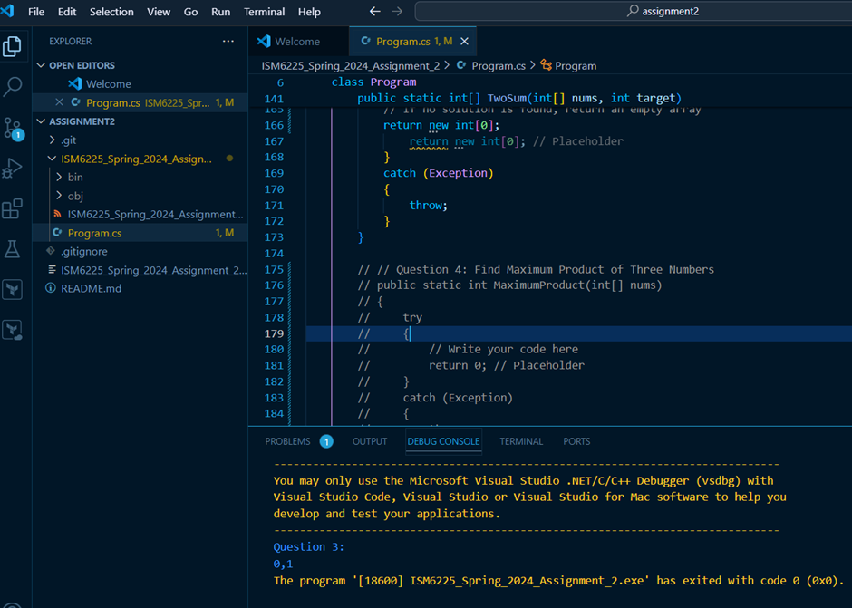
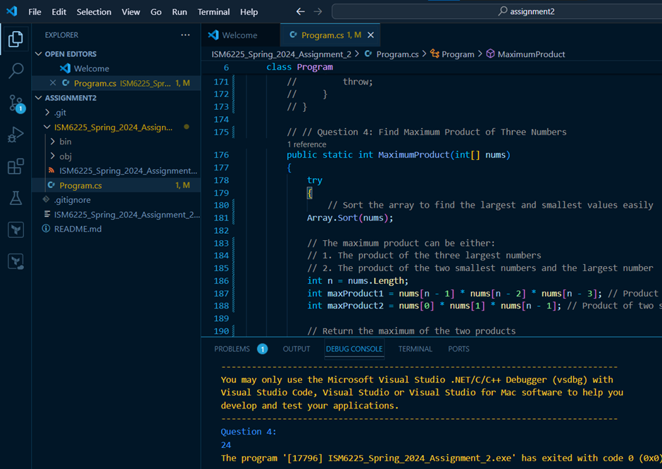
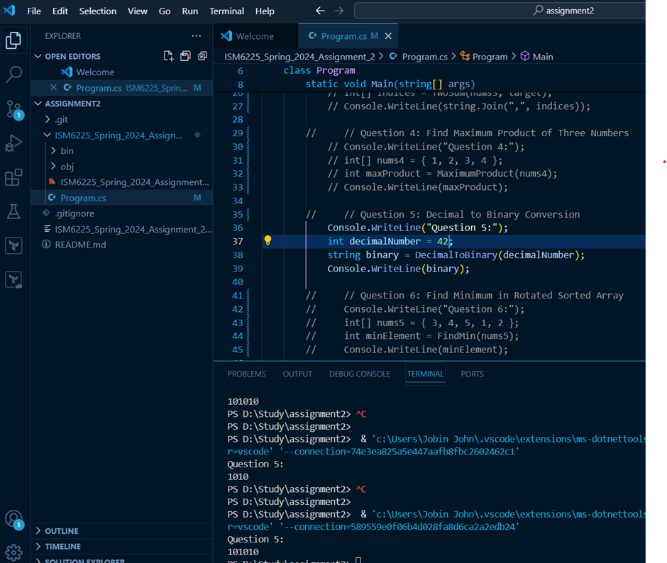
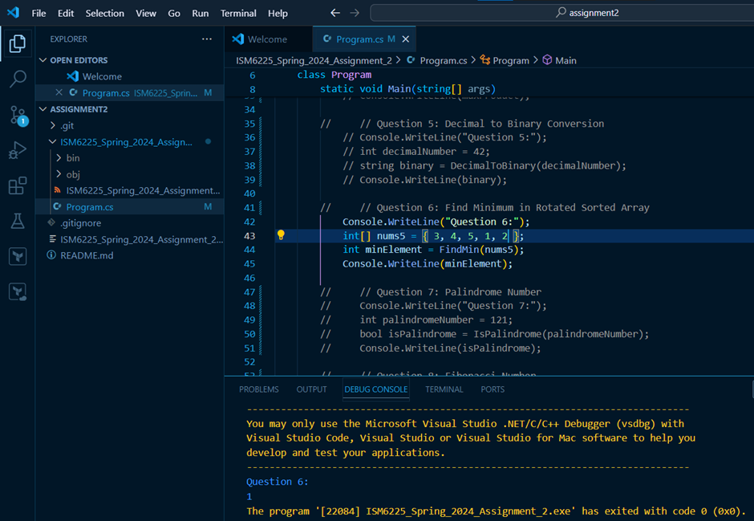
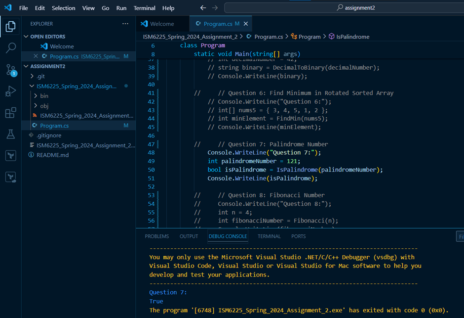
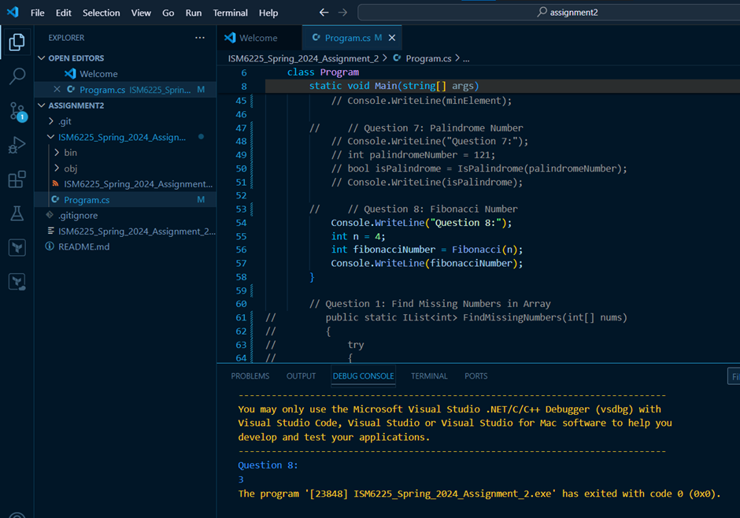

1.	Working on the problem of finding missing numbers in an unsorted array helped me understand in-place algorithms for efficiency. The approach of marking elements as negative to track present numbers enabled an efficient O(n) solution with O(1) space complexity. It was interesting to see how modifying the input array could simplify the solution and eliminate the need for extra data structures.
  

  
2.	Working on the parity sorting problem enhanced my array manipulation skills. I initially used a two-pointer approach, which didn't preserve order. Adapting to a temporary array allowed me to maintain the original positions of even and odd numbers. This reinforced the importance of thoroughly understanding problem requirements before coding.
  
 
   
3.	Working on the Two Sum problem enhanced my understanding of hash tables and their efficiency in solving problems. I learned how to optimize searches using a dictionary to find complements in a single pass. This experience reinforced the importance of considering data structures to improve performance in algorithmic challenges.
  
 
   
4.	Working on the maximum product of three numbers problem enhanced my problem-solving skills. I learned to consider both positive and negative numbers when calculating the maximum product, reinforcing the importance of edge cases. This experience deepened my understanding of sorting and optimized solutions for finding maximum values efficiently.
  
 
  
5.	Working on the decimal to binary conversion reinforced my understanding of number systems and algorithmic thinking. Implementing the conversion logic deepened my appreciation for iterative processes. This exercise highlighted the importance of handling edge cases, such as zero, while improving my coding skills and attention to detail in problem-solving.
  
 
  
6.	Working on the minimum element in a rotated sorted array enhanced my understanding of binary search algorithms. I learned to efficiently handle edge cases, such as non-rotated arrays. This problem reinforced the importance of analyzing the array's properties, improving my problem-solving skills and algorithmic thinking in data structures. 
  

  
7.	Working on the palindrome number problem deepened my understanding of number manipulation and algorithmic efficiency. Implementing the reversal logic without converting the integer to a string challenged my problem-solving skills. This exercise highlighted the importance of handling edge cases, reinforcing my ability to think critically and systematically when coding.
  

   
 
8.	Working on the Fibonacci sequence problem enhanced my understanding of iterative algorithms and their efficiency. Implementing the solution reinforced the importance of handling base cases and using appropriate data structures. This exercise deepened my appreciation for algorithm optimization, as it allowed me to develop clearer and more efficient code.
  
 
  